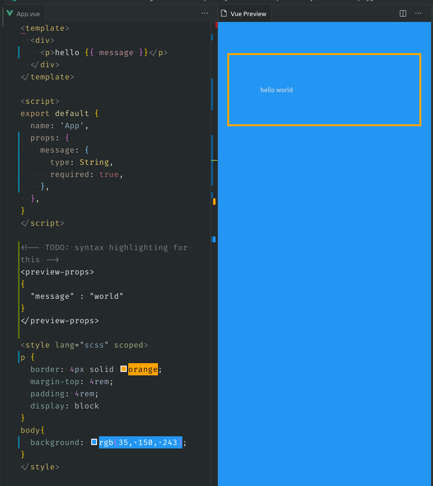

  

# Vue Preview for VSCode

Live editing of Vue files (for now only simple vue files are supported)

## Commands

| Command           | Keybinding   |
| ----------------- | ------------ |
| Vue Preview: Open | `ctrl+alt+p` |
